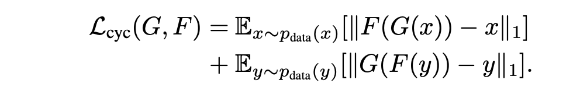

# CycleGAN

- **paper**: [Zhu et al., "Unpaired Image-to-Image Translation using Cycle-Consistent Adversarial Networks"](https://arxiv.org/abs/1703.10593)

### Total loss
- total loss consists of two GAN losses (each for generator) and the cycle-consistency loss

### Cycle-consistency loss
- tells the generators to reduce reconstruction errors

## Examples
- trained on monet2photo dataset

## Failure Cases (CycleGAN Deception)
- CycleGAN learns to hide information in order to reduce reconstruction loss.
- See [my blog post](http://densuh.github.io/jekyll/update/2019/04/24/cyclegan-deception.html) about CycleGAN's deception tricks and the to fix it.
- The fix is to add gaussian noise onto the generated image before reconstructing with the other generator.
- Here are some examples of failing generation, but successful reconstruction is done.

#### monet -> photo -> monet

#### photo -> monet -> photo

### References On CycleGAN Deception
- [reddit on cyclegan mode collapse](https://www.reddit.com/r/MachineLearning/comments/b0a7qq/d_cyclegan_model_collapse_any_bright_ideas/)
